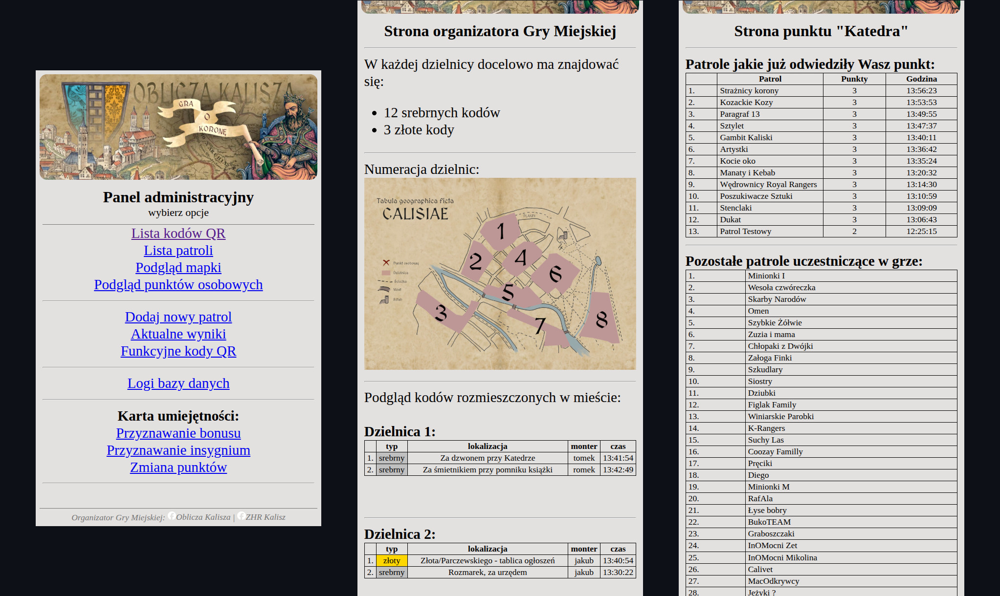
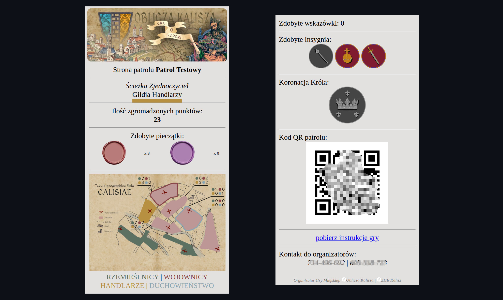

# 🗺️ City quest support application
Application created to support organization of the city quest. Event is organized on Polish Independece Day by Scouting Assosiation I belong to.

Application written in Python with Flask framework and MySQL database.

Project estabilished to make organizers work easier, lower costs of event and offer participants an interactive entertainment.

Application has been used to support 5 editions of event "Oblicza Kalisza". Around 200 people has participated in each. View event [webpage](https://www.facebook.com/ObliczaKalisza).


## ❓ What is a "city quest"?
According to our idea, city quest is a form of game in which participants compete with each other by seeking and solving tasks hidden in some area of a city.
People of all ages, gathered in patrols are pursuing main goal of the quest collecting points and items. There are prizes for the most involved!

This is our alternative for celebrating Independence Day, teaching about history of our city and integrating residents.

<details>

<summary>More details of the quest...</summary>

- every edition differs in main goal, subject and decorations,
- each **patrol** receives **patrol booklet** containing instructions and set of tasks,
- tasks can be presented in different forms e.g., as a list of riddles, encrypted coordinates or points on map,
- whole event is devided into few **stages**, patrols respectively gather informations to use in following stages,
- every city quest has a **main goal**,
- there are two types of tasks:
    - **checkpoints** - QR codes scattered around field of event. Patrols reveal content of task by scanning found code with their mobile phones,
    - **character stations** - hidden locations where patrols carry out physical tasks for disguised characters. To check in to station, patrol must meet conditions described in instructions e.g., complete previous stage or acquire secret password,
- city quest ends at a set time. Patrols must check in at event office. Summary and awards ceremony follows,
- the patrol with the most points wins. Points are awarded for: achieving the main goal, completing 
each stage, completed tasks, received bonuses and time needed to end the quest.
</details>


## 🎯 App main features
- users use application by scanning QR codes with their smartphones. Codes are placed in checkpoints, patrol and organizers booklets and in application itself,
- based on data stored in browser cookies app renders appropriate page,
- by visiting event web address users access home page appropriate to their role.

Depending on role in city quest there are available features:

### 👔 Management:
- password protected administration panel,
- ability to grant organizer privileges by displaying proper QR code,
- managing quest items: monitoring state of checkpoints and work of character stations,
- managing patrols: viewing patrols data, adding unregistered patrols to database, monitoring patrols actions,
- maintaing tasks parameters during event, granting bonuses avalible only in event office,
- monitoring classification and generating final results.

### 🦺 Organizers:
- maintaining checkpoints: linking random QR codes to their function and placement,
- monitoring state of placed checkpoints,
- granting points for filled tasks at character stations,
- maintaining work of character stations: viewing visits history and monitoring remaining patrols,
- granting patrols bonuses according to instructions.

### 🏃 Participants:
- check in and check out for city quest,
- preview of scored points and gathered items,
- digital access to instructions, booklet and tips,
- access to main page with individual QR code necessary to receive points for completed tasks.


## 📷 Screenshots

<details>

<summary>Display examples of usage</summary>



*Left:* **Administration panel** - list of avalible options,

*Center:* **Organizer home page** - contains key instructions, map of districts and summary of already installed checkpoints.

*Right:* **Character home page** shows list of patrols which already visited their station, awarded points and time of visit. Below there is list of remaining patrols in game.

---



Image shows **Patrol home page** (edition 2025).

*Left - from the top of the page*: patrol name, type of path and fellowship, points, gathered items (*stamp*), map with fellowships scores.

*Right - continuation of the page*: collected hints, avalible and collected bonuses, patrol QR code, access to instructions and contact with organizers.
</details>


## 🔨 Operating the app

<details>

<summary>See how users can operate the app</summary>

- to **obtain access to administration panel** you have to visit address: *your_host/admin_permit*,
- then you can access the administration panel via *your_host/admin*,
- to **obtain organizer privileges** user can scan QR code available in administration panel or visit address *your_host/register_organizer* - user will asked for name,
- organizers by scanning QR codes on checkpoints will assign them to districts in database,
- all the checkpoints set by this user will be label with their name in database,
- **character privileges** can be obtained analogously via QR code or: *your_host/register_character*,
- characters grant points to patrols by scanning patrols QR code available in patrol app,
- organizers and characters can visit host address for their home page with summary,
- staff privileges can be removed by scanning proper QR code avalible in the administration panel,
- **patrols assign one phone to the team** by scanning QR code in patrol booklet,
- patrol must confirm its identity by providing last three digits of its phone number given during registration,
- in game, patrols can scan codes on checkpoints and bonuses or visit host address for their home page,
- patrols end game by scanning QR code in event office which stops their game time.
</details>

## 📡 Project deployment
Project in this repository is ready for local testing in docker containers.
Database has to be filled with patrols and tasks data. You can use the administration panel do add patrols and organizer privileges to assign codes to checkpoints.

To run application in Docker containers:
```
git clone https://github.com/dhpasta/ObliczaKalisza.git
cd ObliczaKalisza
docker compose up
```

For the event, project had been deployed to AWS services.

AWS infrastructure designed in Terraform can be found here:
[ObliczaKalisza_AWS_IaC repository](https://github.com/dhpasta/ObliczaKalisza_AWS_IaC).

Simple script provided during instance launch (*init.sh*) acts as application deployment.
It installs required software, clones this repository, switches files prepared for connection with RDS database (suffix *-aws*), loads schema to database and builds up containers.


## 🔔 Planned features
- create registration form for event in app,
- check patrol location when QR code address is requested,
- implement interactions between patrols,
- develop administration panel abilities to maintain app database during preparing and carrying out an event,
- unify and reduce amount of functions in database.py,
- create a test platform for new types of tasks,
- add statistics preview to admin panel e.g., the most and least visited checkpoint.

My main goal is to create universal engine for carrying out such a events just by uploading configuration files and necessary data.
